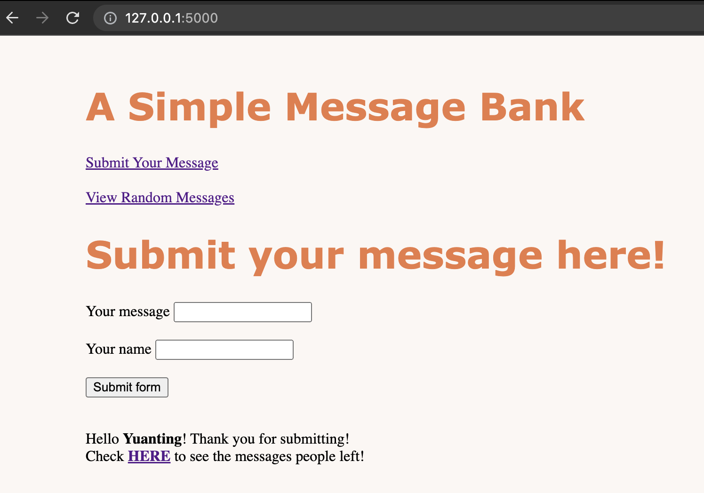
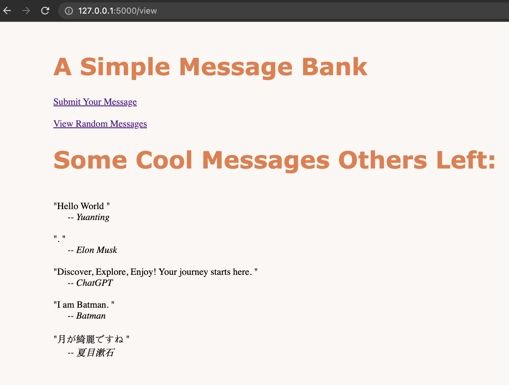

# PIC16B-HW3
 
This is a simple message bank project, which allows users to upload messages to a web page and view some random messages left by others, 
where the messages are storaged in a local sqlite database. The project is based on **flask** library in Python.

Go to my [blog post](https://yuanting.quarto.pub/homework/posts/HW3/) for more details.

Here are screenshots of the webpages it's going to render:

  Page for submitting messages.  

  Page for viewing random messages.  
